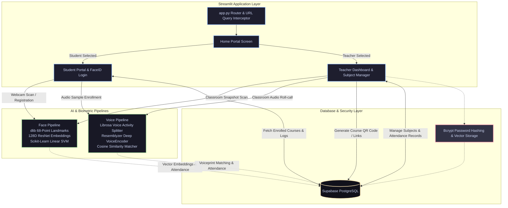

<div align="center">

  

  # SnapClass — AI-Powered Smart Attendance System
  
  > **Multi-Modal AI Attendance Platform leveraging Deep Facial Embeddings & Voice Biometrics for Instant Classroom Roll-Call with a Linear & Cron-Inspired Bento-Grid Interface**

  [](https://python.org)
  [](https://streamlit.io)
  [](https://supabase.com)
  [](https://github.com/ageitgey/face_recognition)
  [](https://github.com/resemble-ai/Resemblyzer)
  [](https://scikit-learn.org)
  [](https://github.com/pyca/bcrypt)
  [](LICENSE)

</div>

---

## 📖 Overview

Traditional classroom attendance methods—such as manual name roll-calls or paper sign-in sheets—consume **10–15 minutes per lecture**, are prone to human error, and suffer from proxy attendance ("buddy punching").

**SnapClass** modernizes educational attendance tracking through an intelligent, **dual-modality biometric platform**:
1. **📸 Computer Vision Pipeline**: Teachers capture or upload a single classroom snapshot. The system automatically detects every student, extracts 128-dimensional facial embeddings, classifies them with a trained SVM model, verifies distance thresholds, and marks attendance in seconds.
2. **🎙️ Voice Biometrics Pipeline**: For audio-based attendance, the teacher records a continuous classroom roll-call. The pipeline splits audio into individual speaker segments using spectral analysis, calculates deep voiceprints via `Resemblyzer`, and matches each voice against registered student voice embeddings.
3. **🎨 Linear & Cron Inspired UX**: High-density Bento-Grid course cards, floating segmented pill tab switchers, monospace code badges (`JetBrains Mono`), and glassmorphism styling for a responsive, modern interface.
4. **📲 Effortless Enrollment**: Subject join links and dynamically generated QR codes allow students to register and auto-enroll into courses in one click.

---

## 🏗️ Architecture & Workflow



---

## 🎨 Design System & UI Highlights

Inspired by **[Linear](https://linear.app)** and **[Cron](https://cron.com)**, SnapClass features a high-density, product-first aesthetic:

- **🍱 Bento-Grid Cards**: Course cards with structured hierarchy, section chips, code badges (`JetBrains Mono`), and high-density stats chips (`👥 Enrolled`, `📅 Sessions`, `📈 Rate`).
- **💊 Segmented Pill Navigation**: Instant tab switcher between *Take Attendance*, *Manage Subjects*, and *Attendance Records* without layout shift.
- **🖼️ Photo Filmstrip**: Gallery cards for classroom snapshots with thumbnail previews and live face-detection status.
- **✨ Micro-Interactions**: Smooth hover lifts (`translateY(-2px)`), glassmorphic backdrops (`backdrop-filter: blur(16px)`), and tailored color themes.

---

## ✨ Key Features

| Feature | Description | Technology Stack |
| :--- | :--- | :--- |
| **📸 Multi-Face Classroom Analysis** | Detects multiple student faces from a single group photo or webcam snapshot, computes 128D facial descriptors, and automatically logs verified students. | `dlib`, `face_recognition_models`, `scikit-learn` |
| **🎙️ Voiceprint Speaker Verification** | Processes batch classroom audio, segments distinct speech utterances, and matches individual voices against enrolled profiles. | `Resemblyzer`, `librosa`, `NumPy` |
| **👤 Passwordless FaceID Student Login** | Students authenticate into their dashboard seamlessly using facial recognition. | `dlib`, `st.camera_input`, `Pillow` |
| **🍱 Bento-Grid Course Management** | Modern modular cards displaying real-time enrollment numbers, classes held, and attendance statistics. | Custom Bento CSS, `JetBrains Mono` |
| **🔗 Dynamic QR Code & Link Sharing** | Generates real-time QR codes and instant join links (`?join-code=...`) for one-click course enrollment. | `segno`, `Streamlit Query Params` |
| **📊 Teacher Analytics & Attendance Logs** | Aggregated attendance stats, per-session history breakdown, and course-level enrollment metrics. | `pandas`, `Streamlit Dataframe` |
| **🛡️ Secure Credential Management** | Salting and hashing of all teacher passwords; biometric data stored as mathematical embedding vectors. | `bcrypt`, `Supabase Auth/DB` |

---

## 🛠️ Tech Stack

<div align="center">

| Domain | Technologies Used |
| :--- | :--- |
| **Frontend & UI** | [Streamlit](https://streamlit.io), Custom Bento CSS, Google Fonts (*Outfit*, *Inter*, *JetBrains Mono*) |
| **Computer Vision** | [dlib](http://dlib.net), [face_recognition_models](https://github.com/ageitgey/face_recognition_models), [Scikit-Learn](https://scikit-learn.org), [Pillow](https://python-pillow.org) |
| **Audio & Speech AI** | [Resemblyzer](https://github.com/resemble-ai/Resemblyzer), [Librosa](https://librosa.org), [NumPy](https://numpy.org) |
| **Database & Cloud** | [Supabase](https://supabase.com) (PostgreSQL Database Engine) |
| **Security & Auth** | [bcrypt](https://pypi.org/project/bcrypt) (Password Encryption), Vectorized Biometrics |
| **Utilities** | [segno](https://segno.readthedocs.io) (QR Code Generation), [Pandas](https://pandas.pydata.org) |

</div>

---

## 🗄️ Database Schema & Supabase Setup

SnapClass requires a Supabase PostgreSQL instance. Run the following SQL migration script in your **Supabase SQL Editor**:

```sql
-- 1. Teachers Table
CREATE TABLE teachers (
    teacher_id BIGSERIAL PRIMARY KEY,
    username TEXT UNIQUE NOT NULL,
    password TEXT NOT NULL,
    name TEXT NOT NULL,
    created_at TIMESTAMPTZ DEFAULT NOW()
);

-- 2. Students Table
CREATE TABLE students (
    student_id BIGSERIAL PRIMARY KEY,
    name TEXT NOT NULL,
    face_embedding JSONB,
    voice_embedding JSONB,
    created_at TIMESTAMPTZ DEFAULT NOW()
);

-- 3. Subjects Table
CREATE TABLE subjects (
    subject_id BIGSERIAL PRIMARY KEY,
    subject_code TEXT UNIQUE NOT NULL,
    name TEXT NOT NULL,
    section TEXT NOT NULL,
    teacher_id BIGINT REFERENCES teachers(teacher_id) ON DELETE CASCADE,
    created_at TIMESTAMPTZ DEFAULT NOW()
);

-- 4. Subject Students Mapping (Enrollment)
CREATE TABLE subject_students (
    id BIGSERIAL PRIMARY KEY,
    student_id BIGINT REFERENCES students(student_id) ON DELETE CASCADE,
    subject_id BIGINT REFERENCES subjects(subject_id) ON DELETE CASCADE,
    created_at TIMESTAMPTZ DEFAULT NOW(),
    UNIQUE(student_id, subject_id)
);

-- 5. Attendance Logs Table
CREATE TABLE attendance_logs (
    id BIGSERIAL PRIMARY KEY,
    student_id BIGINT REFERENCES students(student_id) ON DELETE CASCADE,
    subject_id BIGINT REFERENCES subjects(subject_id) ON DELETE CASCADE,
    timestamp TEXT NOT NULL,
    is_present BOOLEAN NOT NULL DEFAULT FALSE,
    created_at TIMESTAMPTZ DEFAULT NOW()
);
```

---

## 📂 Project Structure

```text
SnapClass-Attendance/
├── .gitignore                       # Ignored build caches & local secrets
├── .streamlit/
│   └── secrets.toml.example         # Example configuration template for Supabase credentials
├── src/
│   ├── components/                  # Modular UI Dialogs and Cards
│   │   ├── dialog_add_photo.py      # Camera capture / bulk photo uploader
│   │   ├── dialog_attendance_results.py # Attendance preview & confirmation table
│   │   ├── dialog_auto_enroll.py    # Auto-enrollment handler for join links
│   │   ├── dialog_create_subject.py # Modal to register new subjects
│   │   ├── dialog_enroll.py         # Student subject join modal
│   │   ├── dialog_share_subject.py  # QR code & invitation link generator
│   │   ├── dialog_voice_attendance.py # Voice attendance recording dialog
│   │   ├── footer.py                # Reusable application footer
│   │   ├── header.py                # Reusable application header
│   │   └── subject_card.py          # Linear-style Bento Card component
│   ├── database/                    # Data Access Layer
│   │   ├── config.py                # Supabase client initializer
│   │   └── db.py                    # Database queries & bcrypt auth functions
│   ├── pipelines/                   # Biometrics & Machine Learning
│   │   ├── face_pipeline.py         # dlib face recognition & SVM classification
│   │   └── voice_pipeline.py        # Librosa audio segmentation & Resemblyzer voiceprints
│   ├── screens/                     # Main Application Views
│   │   ├── home_screen.py           # Portal selector (Student vs Teacher)
│   │   ├── student_screen.py        # FaceID auth, dashboard, & subject enrollment
│   │   └── teacher_screen.py        # Teacher auth, attendance manager, & logs
│   └── ui/
│       └── base_layout.py           # Linear design tokens, fonts, & button styles
├── app.py                           # Application entry point & router
├── requirements.txt                 # Project dependencies
└── README.md                        # Project documentation
```

---

## 🚀 Getting Started

### 1. Prerequisites

- **Python 3.10+** (Python 3.10 - 3.11 recommended)
- **Git**
- **C++ Compiler** (Required for compiling `dlib` if not using pre-built binary wheels):
  - *Windows*: Visual Studio Build Tools with C++ Desktop Development.
  - *macOS*: `xcode-select --install` & `brew install cmake`
  - *Linux (Ubuntu/Debian)*: `sudo apt-get install build-essential cmake libopenblas-dev liblapack-dev`

### 2. Clone the Repository

```bash
git clone https://github.com/Shivam95800/SnapClass-Attendance.git
cd SnapClass-Attendance
```

### 3. Create & Activate a Virtual Environment

```bash
# Windows
python -m venv venv
venv\Scripts\activate

# macOS / Linux
python3 -m venv venv
source venv/bin/activate
```

### 4. Install Dependencies

```bash
pip install -r requirements.txt
```

### 5. Configure Secrets

Create a `.streamlit/secrets.toml` file in the root directory (using `.streamlit/secrets.toml.example` as a template):

```toml
# .streamlit/secrets.toml
SUPABASE_URL = "https://your-supabase-instance.supabase.co"
SUPABASE_KEY = "your-supabase-anon-or-service-key"
```

### 6. Run the Application

```bash
streamlit run app.py
```

The app will launch at `http://localhost:8501`.

---

## ☁️ Deployment on Streamlit Cloud (1-Click)

1. Fork or push this repository to GitHub.
2. Go to [**Streamlit Community Cloud**](https://share.streamlit.io/) and log in with GitHub.
3. Click **"New App"** ➔ Select repository `Shivam95800/SnapClass-Attendance` ➔ Branch `main` ➔ Main file `app.py`.
4. Under **"Advanced settings... ➔ Secrets"**, add your Supabase credentials:
   ```toml
   SUPABASE_URL = "https://your-project.supabase.co"
   SUPABASE_KEY = "your-key"
   ```
5. Click **Deploy!**

---

## 🖥️ User Workflows

### 🎓 Student Flow
1. **FaceID Login**: Position your face in the camera frame to log in automatically.
2. **Registration (New Students)**: If unrecognized, capture your face and optionally record a voice snippet (`"I am present, my name is..."`) to register your profile.
3. **Course Enrollment**: Enter a Subject Code or scan a teacher's QR code / link to automatically enroll.
4. **Attendance Tracking**: View total sessions and attendance percentages across all enrolled subjects.

### 👨‍🏫 Teacher Flow
1. **Teacher Authentication**: Register or log in using your credentials.
2. **Manage Subjects**: Create classes, retrieve unique class codes, and generate QR code join links with Bento Cards.
3. **Take Attendance**:
   - **Photo Mode**: Upload or take group snapshots of the classroom. Click **Run Face Analysis** to recognize all present students.
   - **Voice Mode**: Record a continuous classroom roll-call audio. The AI segments voices and identifies attendees.
4. **Review & Save**: Confirm the detected attendance list before saving it to Supabase.
5. **View Records**: Inspect aggregated class-by-class attendance records and statistics.

---

## 🗺️ Roadmap & Future Enhancements

- [ ] **Live RTSP/WebRTC Video Stream Attendance**: Continuous background attendance tracking without manual snapshot capture.
- [ ] **Liveness Detection & Anti-Spoofing**: Blink and texture detection to prevent photo and screen spoofing.
- [ ] **Automated Export & LMS Integration**: One-click export to Excel/CSV and seamless synchronization with Google Classroom and Canvas LMS.
- [ ] **Email & SMS Notifications**: Automated alerts to students or parents when attendance falls below threshold limits.

---

## 🤝 Contributing

Contributions, issues, and feature requests are welcome!

1. Fork the repository
2. Create your feature branch (`git checkout -b feature/AmazingFeature`)
3. Commit your changes (`git commit -m 'Add some AmazingFeature'`)
4. Push to the branch (`git push origin feature/AmazingFeature`)
5. Open a Pull Request

---

## 📄 License

This project is licensed under the **MIT License** — see the [LICENSE](LICENSE) file for details.

---

<div align="center">
  <sub>Developed with ❤️ by <a href="https://github.com/Shivam95800">Shivam</a> & the Open Source Community.</sub>
</div>